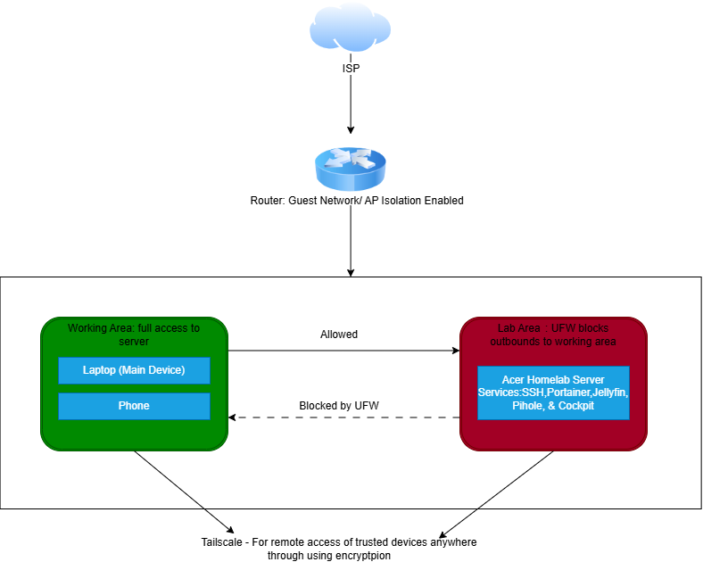

# MasterBBHomelab

A self-hosted home server built from a repurposed Acer laptop — running headless Debian Linux with a Docker-based service stack for media, network management, and remote access.

## Why

Wanted hands-on experience with real server administration — installing Linux from scratch, managing everything over SSH, containerizing services, and thinking through network security — instead of just reading about it. This repo documents that process end to end, including the mistakes.

## Hardware

| Component | Spec |
|---|---|
| Device | Acer Extensa 2519 (repurposed laptop) |
| CPU | Intel Celeron N3060 @ 1.6GHz |
| RAM | 4GB |
| Storage | 240GB Kingmax SSD |
| OS | Debian 13 (headless, no desktop environment) |

## Architecture

The server runs headless, managed entirely over SSH from a separate main laptop. Services are containerized with Docker and managed via Portainer.

- **Trusted zone**: main laptop + phone, full local network access
- **Lab zone**: the homelab server, isolated from the trusted zone via router-level guest network / AP isolation
- **Remote access**: Tailscale only — no ports forwarded directly to the internet

## Services

**Network & management**
- **Pi-hole** — network-wide DNS ad/tracker blocking
- **Tailscale** — encrypted remote access without exposing ports publicly
- **Portainer** — web UI for managing Docker containers
- **Cockpit** — server health/resource monitoring
- **UFW** — host-level firewall, restricting inbound traffic to only what each service needs

**Media stack**
- **Jellyfin** — media streaming server
- **Jellyseerr** — request interface for new movies/shows
- **Sonarr** / **Radarr** — automated finding of requested series/movies
- **Prowlarr** — syncs indexers/trackers across Sonarr and Radarr
- **Transmission** — BitTorrent client used by the automation stack

## Build log

| Date | Milestone |
|---|---|
| Jul 22, 2026 | Installed Debian Linux (replacing the original OS), configured SSH access, removed the GNOME desktop environment to run fully headless, and installed Pi-hole, Docker, Portainer, and Cockpit |
| Jul 23, 2026 | Built an automated media system using **Jellyfin** (streaming), **Jellyseerr** (requests), **Sonarr** & **Radarr** (media finding), **Prowlarr** (tracker sync), and **Transmission** (torrent downloader) |
| Jul 24–25, 2026 | Configured **Tailscale** for secure remote access and implemented network segmentation, isolating the server into its own zone separate from trusted personal devices |

## Lessons learned

- Debian's netinst doesn't add the first user to the `sudo` group if you set a separate root password during install — worth knowing before you're locked out of `sudo`.
- DNS-level ad blocking (Pi-hole) can't stop everything — on-page popups/redirects need a browser-level blocker (uBlock Origin) alongside it.
- Browsers and OSes can have their own DNS settings (e.g. Chrome/Opera's "secure DNS") that silently override your network DNS config — worth checking if Pi-hole seems to not be working.

## Roadmap

- [ ] Apply UFW firewall rules restricting inbound traffic per service
- [ ] Migrate media stack to Docker Compose
- [ ] Upgrade from software-level segmentation to true VLAN isolation once VLAN-capable hardware is available
- [ ] Set up automated backups for service configs

## Specs & credits

Built and documented by [Vincent John Tamaño](https://github.com/vincenttamano).
